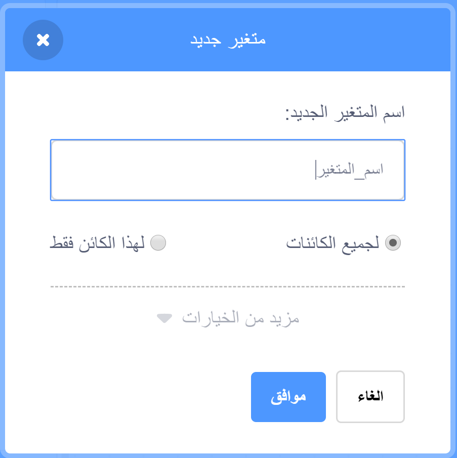

+ Click on **Variables** in the Code tab, then click on **Make a Variable**.
    
    

+ قم بكتابة اسم للمتغير. يمكنك اختيار ما إذا كنت تريد هذا المتغير أن يكون متاح لجميع الكائنات، أو فقط لهذا المتغير. اضغط على **موافق**.
    
    

+ بمجرد إنشاء المتغير، سيظهر على المنصة، أو يمكنك إلغاء تحديد المتغير من علامة تبويب النصوص البرمجية لإخفائه.
    
    