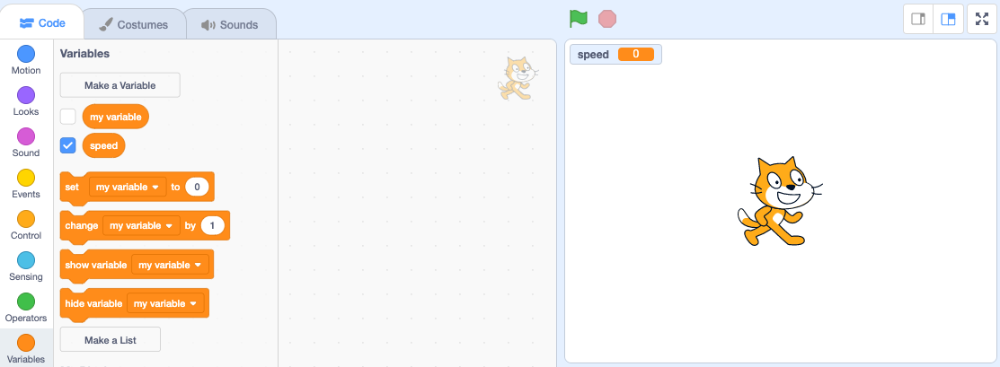

+ Click on **Variables** in the Code tab, then click on **Make a Variable**.
    
    

+ Type in the name of your variable. You can choose whether you would like your variable to be available to all sprites, or to only this sprite. Press **OK**.
    
    

+ ভেরিয়েবল তৈরি করার পর তা স্টেজে দেখা যাবে, অথবা আপনি স্ক্রিপ্ট ট্যাবে টিক দিয়ে একে সরিয়ে রাখতে পারেন যেন স্টেজে দেখা না যায়।
    
    