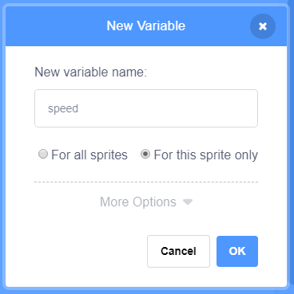

+ কোড ট্যাবের **Variables** ক্লিক করুন, তারপর **Make a Variable** এর উপরে ক্লিক করুন.
    
    

+ আপনার variable এর নামে টাইপ করুন।. আপনি variable টি সমস্ত sprite এর জন্য উপলব্ধ করতে চান নাকি শুধু মাত্র এটার জন্য উপলব্ধ করতে চান তা ঠিক করতে পারেন।. **OK** চাপুন.
    
    

+ Variable তৈরি করার পর তা স্টেজে দেখা যাবে, অথবা আপনি স্ক্রিপ্ট ট্যাবে টিক দিয়ে একে সরিয়ে রাখতে পারেন যাতে স্টেজে দেখা না যায়।.
    
    