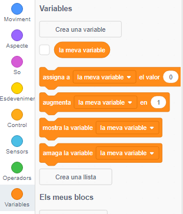

+ A la pestanya Codi fes clic a **Variables** i, a continuació, fes clic a **Crea una variable**.
    
    

+ Escriu el nom de la teva variable. Pots triar si vols que la teva variable estigui disponible per a tots els personatges o només per a aquest personatge. Prem **D'acord**.
    
    

+ Una vegada que hagis creat la variable, aquesta es mostrarà a l'escenari. Si no vols que hi aparegui pots desmarcar-la a la pestanya Codi.
    
    