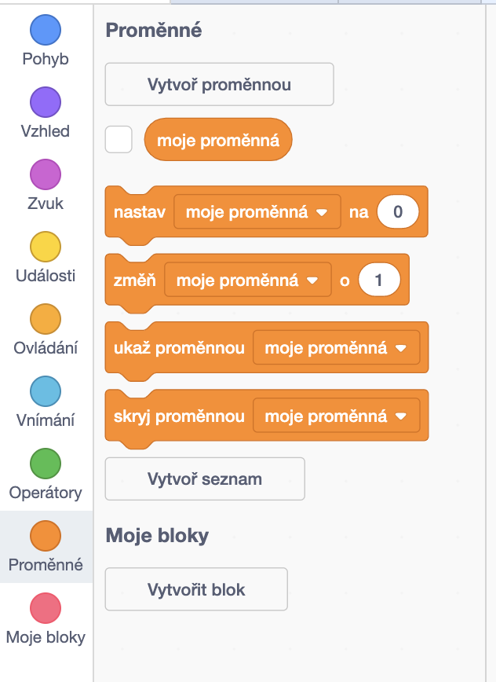
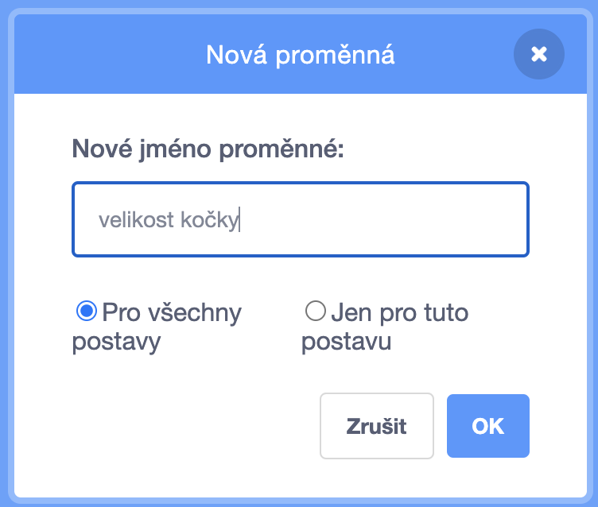
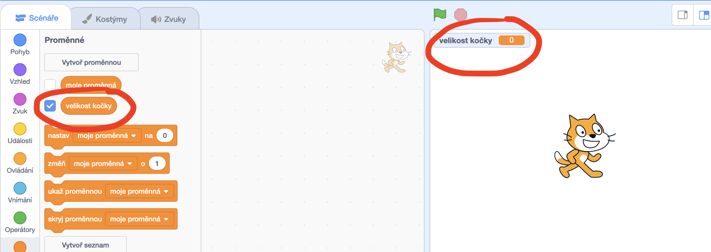

+ Klikni na položku **Proměnné** na záložce Scénáře a následně klikní na tlačítko **Vytvoř proměnnou**.
    
    

+ Zadej název proměnné. Můžeš si vybrat, zda chceš, aby nová proměnná byla k dispozici všem postavám nebo pouze této postavě. Nakonec stiskni tlačítko **OK**.
    
    

+ Jakmile vytvoříš proměnnou, zobrazí se na ploše scény. Můžeš ji skrýt odzaškrtnutím v seznamu proměnných.
    
    