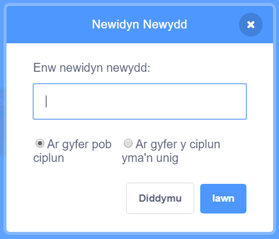

+ Click on **Variables** in the Code tab, then click on **Make a Variable**.
    
    

+ Type in the name of your variable. You can choose whether you would like your variable to be available to all sprites, or to only this sprite. Press **OK**.
    
    

+ Ar ôl i ti greu'r newidyn, bydd yn ymddangos ar y Llwyfan, neu gelli di ddileu tic y newidyn yn y tab Sgriptiau i'w guddio.
    
    