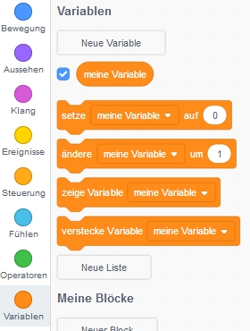
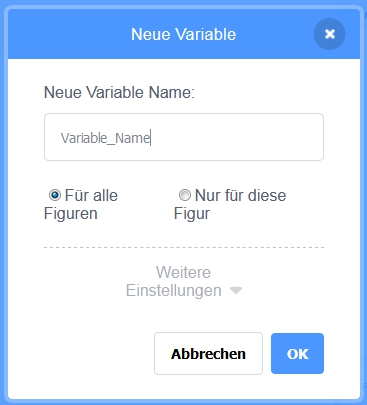
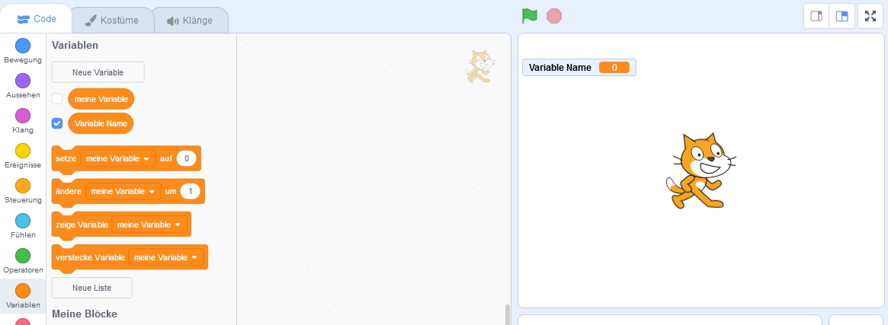

+ Click on **Variables** in the Code tab, then click on **Make a Variable**.
    
    

+ Type in the name of your variable. You can choose whether you would like your variable to be available to all sprites, or to only this sprite. Press **OK**.
    
    

+ Nachdem du die Variable erstellt hast, wird sie auf der Bühne angezeigt, oder sie wird versteckt, wenn du das Häkchen vor der Variablen in der Registerkarte Skripte entfernst.
    
    