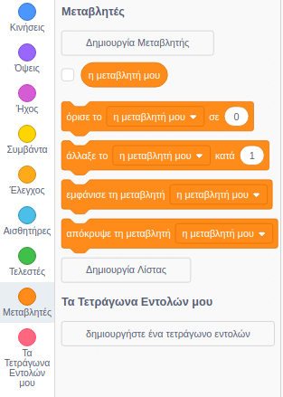
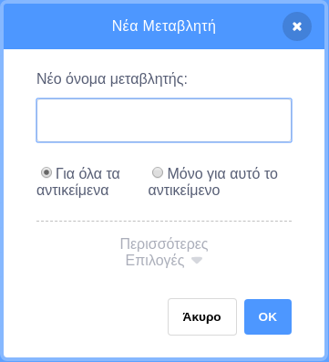
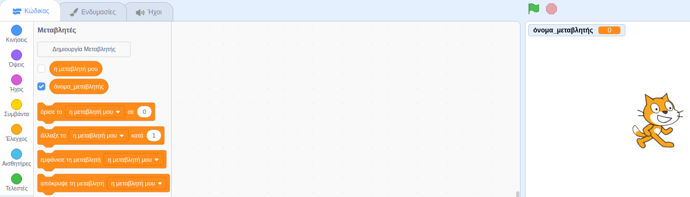

+ Κάνε κλικ στις **Μεταβλητές** στην καρτέλα Κώδικας και, στη συνέχεια, κάνε κλικ στη **Δημιουργία Μεταβλητής**.
    
    

+ Πληκτρολόγησε το όνομα της μεταβλητής σου. Μπορείς να επιλέξεις αν θέλεις να είναι διαθέσιμη η μεταβλητή σου σε όλα τα αντικείμενα (sprites) ή μόνο σε αυτό το αντικείμενο. Πάτησε **ΟΚ**.
    
    

+ Μόλις δημιουργήσεις τη μεταβλητή, θα εμφανιστεί στο Σκηνικό. Μπορείς να αποεπιλέξεις τη μεταβλητή στην καρτέλα Σενάρια για να την αποκρύψεις.
    
    