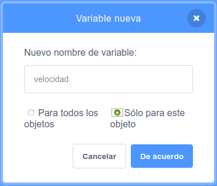

+ Click on **Variables** in the Code tab, then click on **Make a Variable**.
    
    

+ Type in the name of your variable. You can choose whether you would like your variable to be available to all sprites, or to only this sprite. Press **OK**.
    
    

+ Una vez creada la variable se mostrará en el Escenario, o puedes desmarcar la variable en la pestaña Programas para ocultarla.
    
    