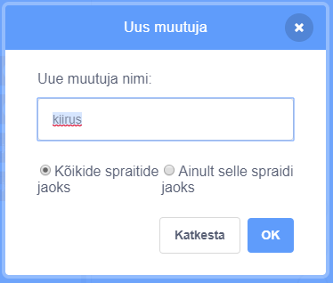
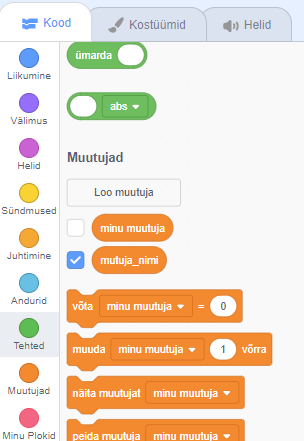

+ Klõpsa vahekaardil Kood **Muutujatel**, seejärel klõpsa **Defineeri muutuja**.
    
    

+ Sisesta oma muutuja nimi. Saad valida, kas soovid, et sinu muutuja oleks kõikidele spraitidele kättesaadav või ainult sellele spraitile. Vajuta **OK**.
    
    

+ Kui oled muutuja loonud, kuvatakse see Laval, aga saad selle peitmiseks vahekaardil Skriptid muutuja eest linnukese ära võtta.
    
    