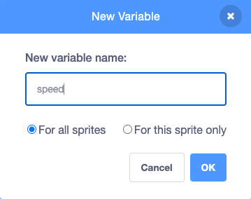

+ بر روی **Variables** در زبانه‌ی Code کلیک کنید، سپس بر روی **Make a Variable** کلیک کنید.
    
    

+ نام متغیر خود را وارد کنید. شما می‌توانید انتخاب کنید که آیا می‌خواهید متغیر شما برای تمام شبح‌ها موجود باشد یا فقط برای این شبح در دسترس باشد. روی ** OK** کلیک کنید.
    
    

+ هنگامی که متغیر را ایجاد کرده‌اید، در صحنه نمایش داده می‌شود، شما می‌توانید با برداشتن علامت آن در زبانه‌ی Scripts، آن را پنهان کنید.
    
    