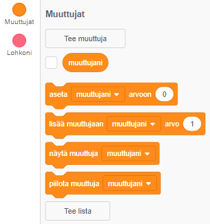
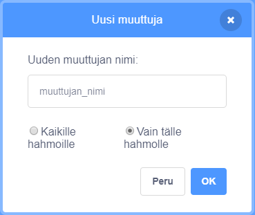
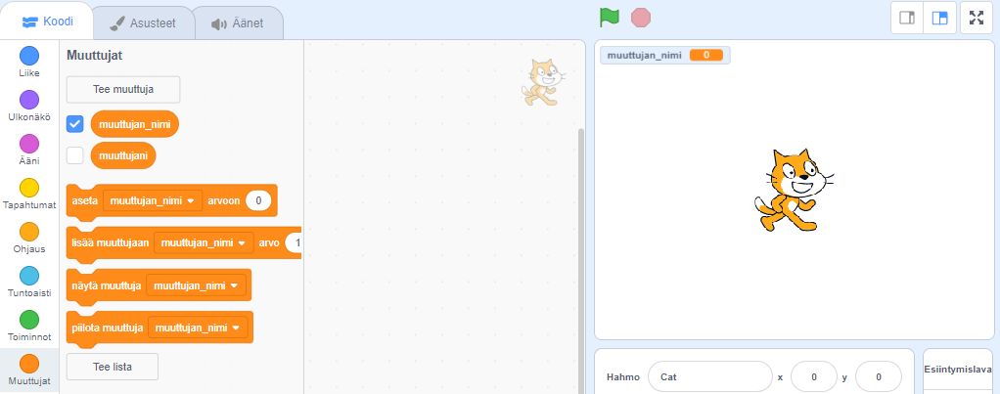

+ Klikkaa Koodi-välilehdellä **Muuttujat**, sitten klikkaa **Tee muuttuja**.
    
    

+ Kirjoita muuttujan nimi. Voit valita, haluatko muuttujasi olevan kaikkien hahmojen käytettävissä tai vain tämän hahmon. Paina **OK**.
    
    

+ Kun olet luonut muuttujan, se näkyy Näyttämöllä, tai voit poistaa muuttujan valinnan Skriptit-välilehdellä piilottaaksesi sen.
    
    