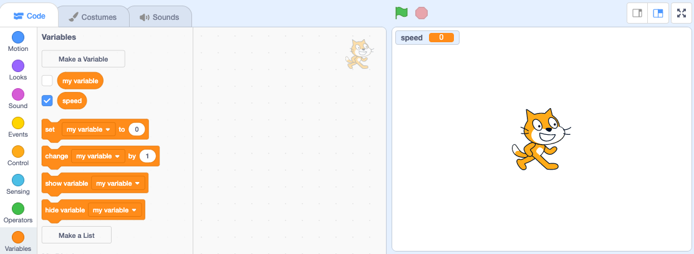

+ I-click ang **Variables** sa tab ng Code at i-click ang **Make a Variable**.
    
    

+ I-type ang pangalan ng iyong variable. Maari kang pumili kung gusto mo maging available ang iyong list sa lahat ng sprites o para lamang sa sprite na ito. Pindutin ang **OK**.
    
    

+ Kapag nagawa mo na yung list, makikita mo ito sa stage, o pwede mo alisin ang list sa Scripts tab upang itago ito.
    
    