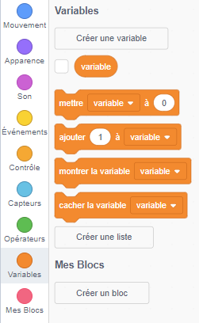
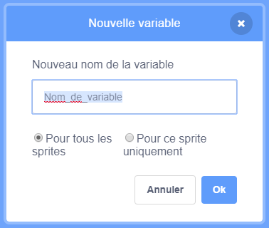
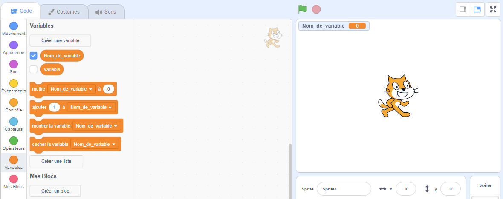

+ Clique sur **Variables** dans l'onglet Scripts puis clique sur **Créer une variable**.
    
    

+ Écris le nom de ta variable. Tu peux choisir si ta variable est disponible pour tous les lutins ou seulement pour celui ci. Appuie sur **OK**.
    
    

+ Une fois que tu as créé la variable, elle s'affiche sur la scène, ou tu peux la décocher dans l'onglet Scripts pour la masquer.
    
    
