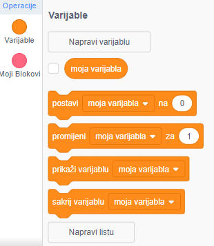
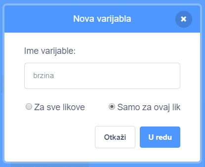
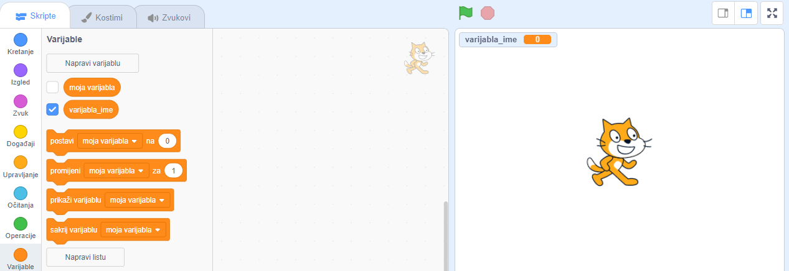

+ Klikni na **Varijable** na kartici Skripte, a zatim na **Napravi varijablu**.
    
    

+ Upiši naziv svoje varijable. Možeš odabrati želiš li da tvoja varijabla bude dostupna svim likovima ili samo određenom liku. Klikni na **U redu**.
    
    

+ Nakon što napraviš varijablu, ona će se prikazati na pozornici. Za uklanjanje varijable s Pozornice, možeš maknuti kvačicu kraj varijable na kartici Skripte.
    
    