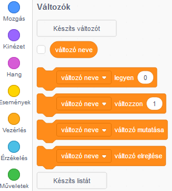
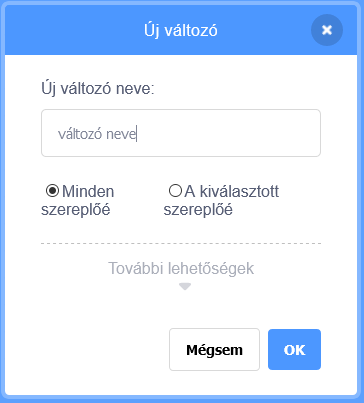
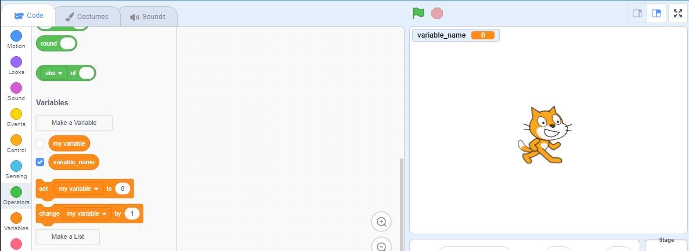

+ A Kód fülön kattints a **Változók** elemre, majd kattints a **Készíts változót** gombra.
    
    

+ Írd be a változó nevét. Kiválaszthatod, hogy a változó elérhető legyen-e minden szereplőnek, vagy csak ennek a szereplőnek. Nyomd meg az **OK** gombot.
    
    

+ Miután létrehoztad a változót, megjelenik a játéktéren, de el is rejtheted a változót a Változók fülön a jelölőnégyzettel.
    
    