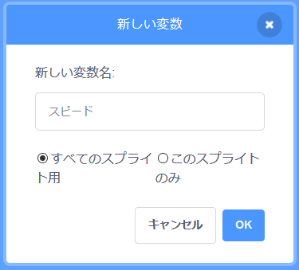

+ Click on **Variables** in the Code tab, then click on **Make a Variable**.
    
    

+ Type in the name of your variable. You can choose whether you would like your variable to be available to all sprites, or to only this sprite. Press **OK**.
    
    

+ 変数の作成後、その変数がステージに表示されますが、[スクリプト]タブで変数の設定を解除すると隠すことができます。
    
    