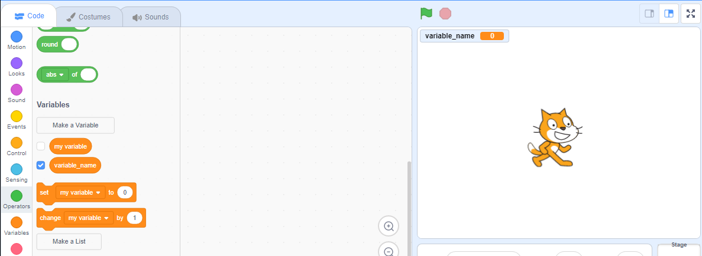

+ ಕೋಡ್ ಟ್ಯಾಬ್‌ನಲ್ಲಿ **Variables (ವೇರಿಯೇಬಲ್ಸ್)** ಕ್ಲಿಕ್ ಮಾಡಿ, ನಂತರ **Make a Variable (ಮೇಕ್ ಎ ವೇರಿಯಬಲ್)**ಕ್ಲಿಕ್ ಮಾಡಿ.
    
    

+ ನಿಮ್ಮ ವೇರಿಯೇಬಲ್ ಹೆಸರಿನಲ್ಲಿ ಟೈಪ್ ಮಾಡಿ. ನೀವು ವೇರಿಯೇಬಲ್ ಎಲ್ಲಾ ಸ್ಪ್ರೈಟ್‌ಗಳಿಗೆ ಲಭ್ಯವಾಗಬೇಕೆಂದು ನೀವು ಬಯಸುತ್ತೀರಾ ಅಥವಾ ಈ ಸ್ಪ್ರೈಟ್‌ಗೆ ಮಾತ್ರ ನೀವು ಆಯ್ಕೆ ಮಾಡಬಹುದು. **OK**ಒತ್ತಿರಿ.
    
    

+ ಒಮ್ಮೆ ನೀವು ವೇರಿಯೇಬಲ್ ಅನ್ನು ರಚಿಸಿದ ನಂತರ, ಅದನ್ನು ಸ್ಟೇಜ್‌ನಲ್ಲಿ ಪ್ರದರ್ಶಿಸಲಾಗುತ್ತದೆ, ಅಥವಾ ಅದನ್ನು ಮರೆಮಾಡಲು ನೀವು ಸ್ಕ್ರಿಪ್ಟ್‌ಗಳ ಟ್ಯಾಬ್‌ನಲ್ಲಿ ವೇರಿಯೇಬಲ್ ಅನ್ನು ಗುರುತಿಸಬಾರದು.
    
    