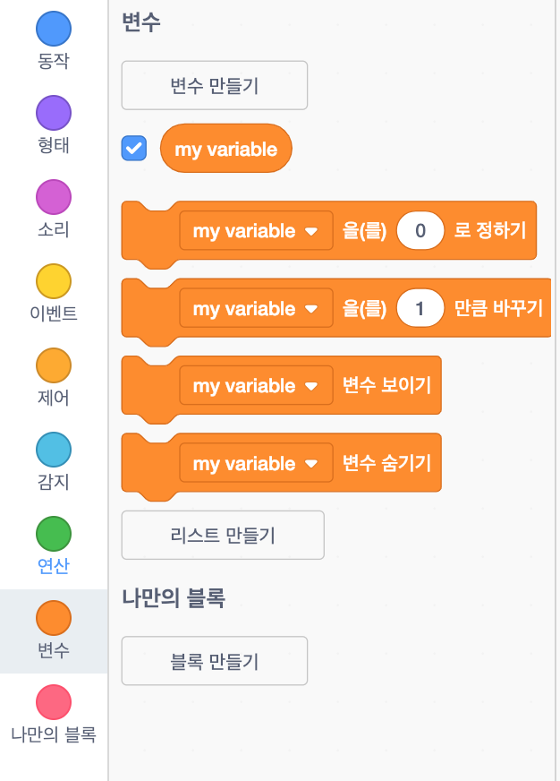
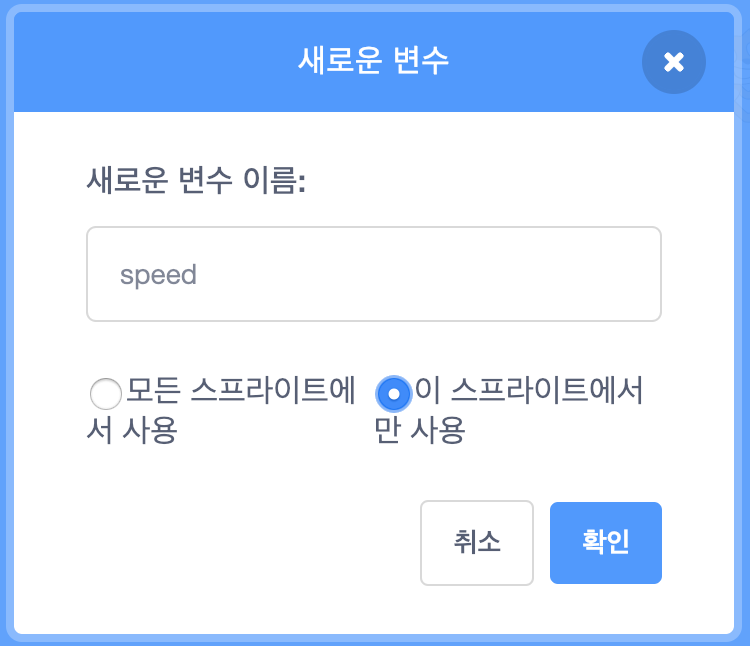
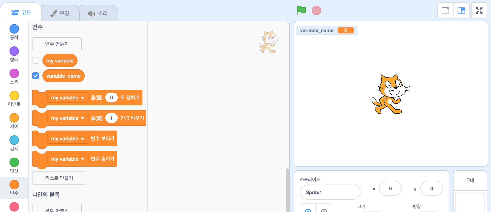

+ 코드 탭에서 **변수** 를 클릭한 다음 **변수 확인** 클릭.
    
    

+ 변수의 이름을 입력하십시오. 변수를 모든 스프라이트에 사용할 지 또는 이 스프라이트에만 사용할지를 선택할 수 있습니다. **확인** 키를 누릅니다.
    
    

+ 변수를 만든 후에는 스테이지에 변수가 표시되고, 혹은 스크립트 탭에서 해당 변수의 표시를 지워서 숨길 수 있습니다.
    
    