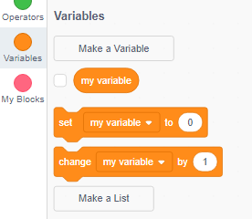

+ कोड टॅबमध्ये **Variables** वर क्लिक करा, नंतर **Make a Variable** वर क्लिक करा.
    
    

+ आपल्या अनित्य संख्याच्या नाव लिहा. आपण आपला बदल सर्व स्प्राइट्सकरिता उपलब्ध होऊ इच्छित आहात की केवळ या स्प्राइटसाठी हे निवडू शकता. **OK**दाबा.
    
    

+ एकदा आपण अनित्य (Variable) संख्या तयार केल्यावर ते पटावर प्रदर्शित होईल किंवा याला लपविण्यासाठी अनित्य (Variable) संख्या अचिन्ह स्क्रिप्ट टॅबमध्ये करू शकता.
    
    