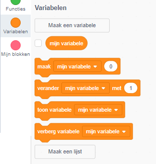
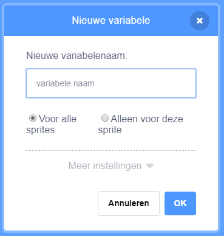
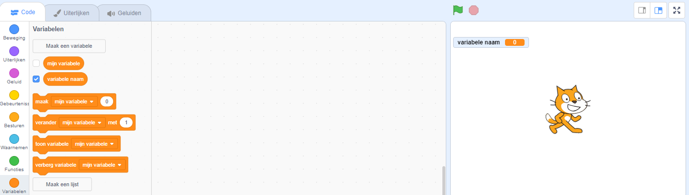

+ Click on **Variables** in the Code tab, then click on **Make a Variable**.
    
    

+ Type in the name of your variable. You can choose whether you would like your variable to be available to all sprites, or to only this sprite. Press **OK**.
    
    

+ Nadat je de variabele hebt gemaakt, wordt die in het werkgebied weergegeven, maar je kunt de variabele in het tabblad Scripts ook uitvinken om hem te verbergen.
    
    