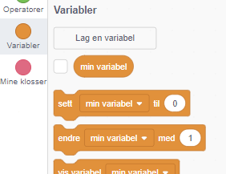
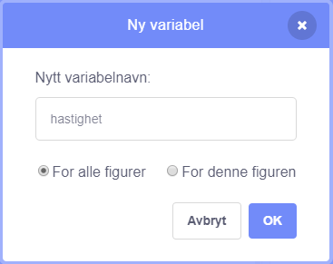
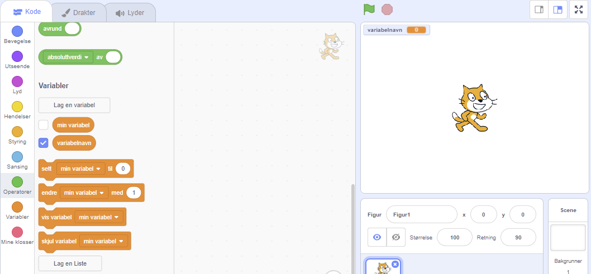

+ Klikk på **Variabler** i Kode-arkfanen, klikk deretter på **Lag en variabel**.
    
    

+ Skriv inn navnet på variabelen din. Du kan velge om du vil at variabelen skal være tilgjengelig for alle figurer, eller til bare denne figuren. Trykk **OK**.
    
    

+ Når du har opprettet variabelen vil den bli vist på scenen, eller du kan fjerne krysset ved variabelen på kode-arkfanen for å skjule den.
    
    