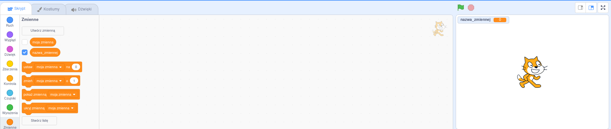

+ Click on **Variables** in the Code tab, then click on **Make a Variable**.
    
    

+ Wpisz nazwę swojej zmiennej. Możesz wybrać, czy chcesz, aby zmienna była dostępna dla wszystkich duszków, czy tylko dla tego duszka. Kliknij **OK**.
    
    

+ Po utworzeniu zmiennej zostanie ona wyświetlona na planszy. Możesz też odznaczać ją na karcie Skrypty, aby ją ukryć.
    
    