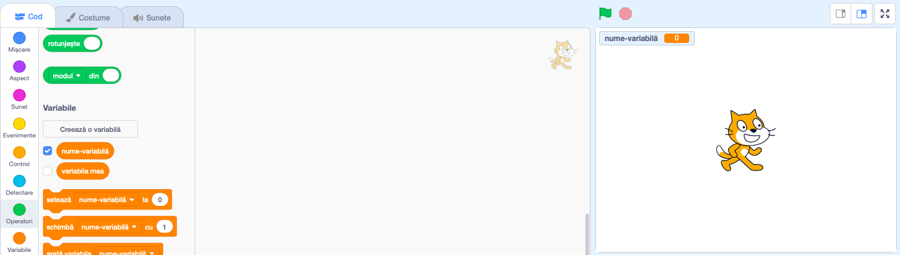

+ Click on **Variables** in the Code tab, then click on **Make a Variable**.
    
    

+ Tastează numele variabilei tale. Poți alege ca variabila ta să fie accesibilă pentru toate personajele, sau doar pentru acest personaj. Apasă **OK**.
    
    

+ Odată ce ai creat variabila, aceasta va fi afișată pe Scenă, sau poți deselecta variabila din tab-ul Cod pentru a o ascunde.
    
    