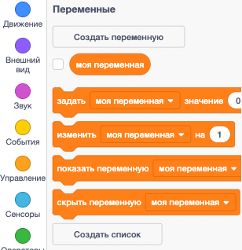

+ Щелкни по кнопке **Переменные** на вкладке Код, затем щелкни на **Создать переменную**.
    
    

+ Введи имя своей переменной. Ты можешь выбрать, хочешь ли ты, чтобы твоя переменная была доступна всем спрайтам, или только для этого спрайта. Нажми **OK**.
    
    

+ После создания переменной, она будет отображаться в рабочей области. Также можно спрятать эту переменную -- для этого нужно убрать галочку (V) во вкладке "Скрипты".
    
    