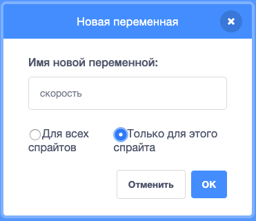

+ Click on **Variables** in the Code tab, then click on **Make a Variable**.
    
    

+ Type in the name of your variable. You can choose whether you would like your variable to be available to all sprites, or to only this sprite. Press **OK**.
    
    

+ Once you have created the variable, it will be displayed on the Stage, or you can untick the variable in the Scripts tab to hide it.
    
    