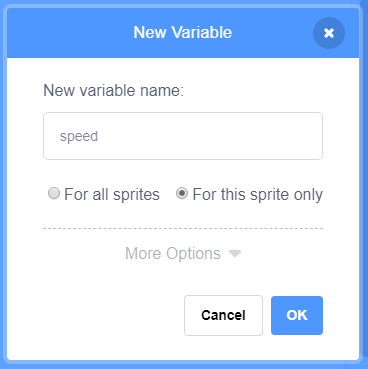

+ කේත පටිත්තෙහි(Code tab එකේ) **විචල්‍යයන්(Variables)** මත ක්ලික් කරන්න, ඉන්පසු **විචල්‍යයක් සෑදීම(Make a Variable) **මත ක්ලික් කරන්න.
    
    

+ ඔබේ විචල්යයේ(Variable එකේ) නම ටයිප් කරන්න. ඔබේ විචල්‍යය(variable එක) සියලුම sprite වලට ලබා ගැනීමට හැකි පරිදි හෝ මෙම sprite එකට පමණක් ලබා ගැනීමට හැකිද යන්න ඔබට තෝරා ගත හැකිය. **හරි(OK)** ඔබන්න.
    
    

+ ඔබ විචල්‍යය(variable එක) නිර්මාණය කළ පසු, එය වේදිකාවේ දර්ශනය වනු ඇත, නැතහොත් ඔබට එය සැඟවීමට ස්ක්‍රිප්ට් පටිත්තෙහි(Script tab එකේ) විචල්‍යය ටික් එක ඉවත් කළ හැකිය.
    
    