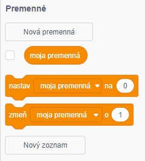
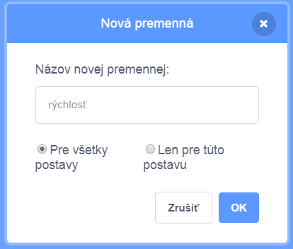
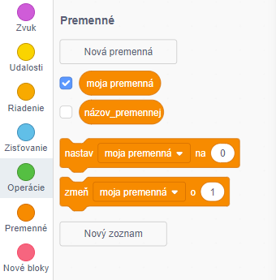

+ Na záložke Kód kliknite na **Premenné** a potom na tlačidlo **Nová premenná**.
    
    

+ Zadajte názov premennej. Môžete si vybrať, či chcete, aby bola vaša premenná k dispozícii všetkým postavám, alebo iba tejto postave. Stlačte **OK**.
    
    

+ Akonáhle vytvoríte premennú, zobrazí sa na scéne. Ak chcete jej zobrazenie na ploche zrušiť, odstráňte jej zaškrtnutie na záložke Skripty.
    
    