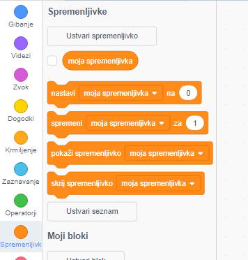

+ Click on **Variables** in the Code tab, then click on **Make a Variable**.
    
    

+ Vnesi ime spremenljivke. Izbereš lahko ali naj bo tvoja spremenljivka na voljo vsem figuram ali zgolj tej figuri. Pritisni **OK**.
    
    

+ Ko ustvariš spremenljivko, se bo ta prikazala na odru, lahko pa jo tudi skriješ, tako da spremenljivko odznačiš v zavihku Koda.
    
    