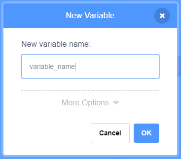

+ Code தத்தலில்(tab) உள்ள **Variables** என்பதைக் கிளிக் செய்க, பின்னர் **Make a Variable**. என்பதைக் கிளிக் செய்க.
    
    

+ உங்கள் மாறியின்(variable) பெயரை தட்டச்சு செய்க. உங்கள் மாறி அனைத்து Sprite-டிற்கும் கிடைக்க வேண்டுமா அல்லது இந்த sprite-க்கு மட்டுமே கிடைக்க வேண்டுமா என நீங்கள் தேர்வு செய்யலாம். **OK** -ஐ அழுத்தவும்.
    
    

+ நீங்கள் மாறியை உருவாக்கியதும், அது மேடையில் (Stage) காட்டப்படும், அல்லது அதை மறைக்க Scripts(ஸ்கிரிப்டுகள்) தத்தலில் சரி குறியீட்டை நீக்கவும்.
    
    