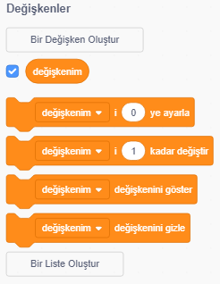
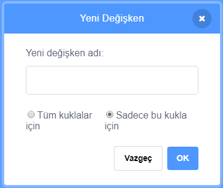
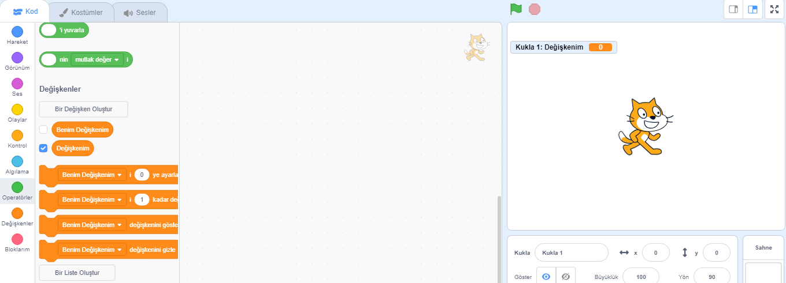

+ Kod sekmesinden **Değişkenler** 'e tıklayın, ardından **Bir Değişken Oluştur** 'a tıklayın.
    
    

+ Değişkeniniz için bir isim yazın. Değişkeninizin tüm kostümler için mi yoksa yalnızca bu kostüm için geçerli olmasını, isteyip istemediğinizi seçebilirsiniz. **TAMAM** tuşuna basın.
    
    

+ Değişkeni oluşturduktan sonra, Sahne'de gözükecektir. Gizlemek için Diziler sekmesinde değişkenin yan tarafındaki tiki kaldırabilirsiniz.
    
    