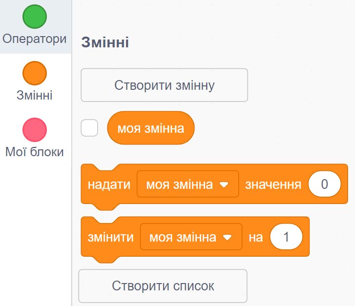
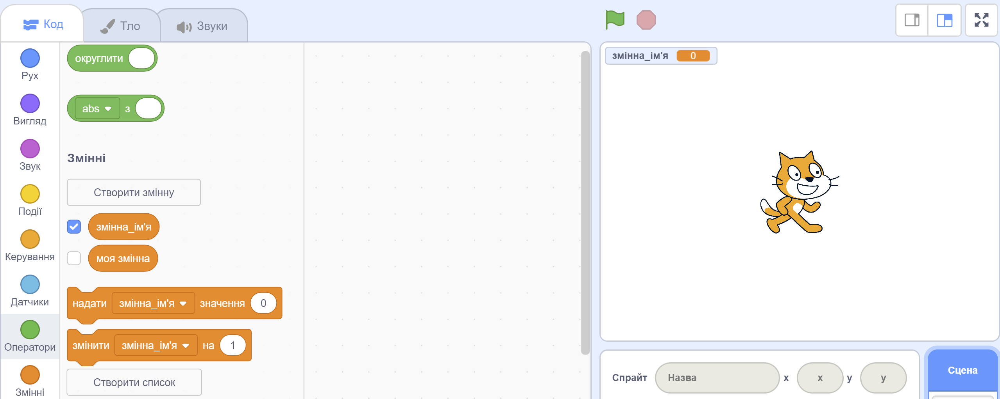

+ Натисни на розділ **Змінні** у вкладці Код, потім натисни **Створити змінну**.
    
    

+ Введи назву для своєї змінної. В тебе є вибір: твоя змінна може бути доступною для всіх спрайтів, або тільки для цього конкретного спрайта. Натисни **Гаразд**.
    
    

+ Після створення змінної вона буде відображатися на Сцені, або ти можеш зняти галочку зі змінної на вкладці Скриптів, щоб приховати її.
    
    
