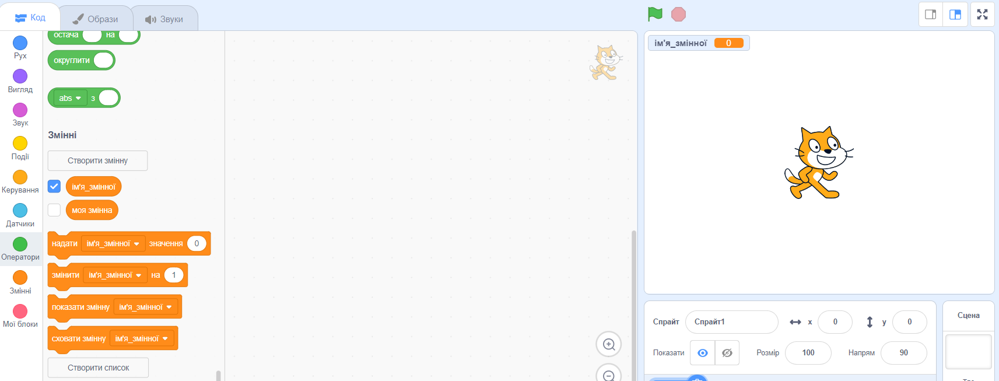

+ Натисни на розділ **Змінні** у вкладці Код, потім натисни **Створити змінну**.
    
    

+ Введи ім'я своєї змінної. В тебе є вибір: твоя змінна може бути доступною для всіх спрайтів, або тільки для цього конкретного спрайта. Натисни **Гаразд**.
    
    

+ Після того, як ти створив (-ла) змінну, вона буде показана на Сцені, якщо ж ти цього не хочеш, то можеш зняти галочку зі змінної на вкладці Код, щоб сховати її.
    
    