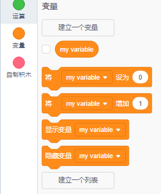
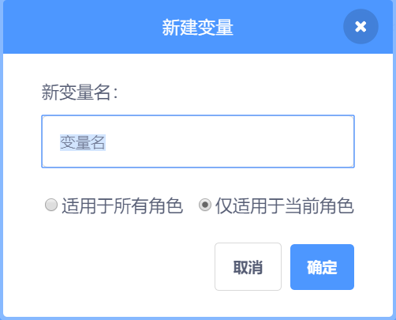
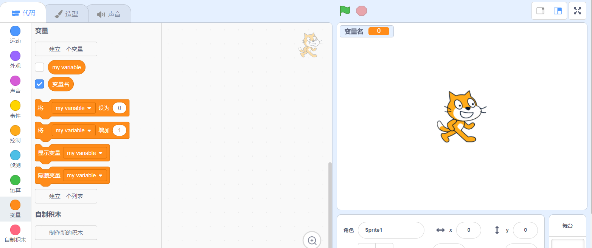

+ Click on **Variables** in the Code tab, then click on **Make a Variable**.
    
    

+ Type in the name of your variable. You can choose whether you would like your variable to be available to all sprites, or to only this sprite. Press **OK**.
    
    

+ 一旦你创建了变量，它会显示在舞台上，或者您可以在“脚本”选项卡中取消选中该变量以隐藏它。
    
    